# Depthbound

**A 3D action roguelite for phones: a prisoner descends through a flooded dungeon and has to clear each floor before the water takes it.**

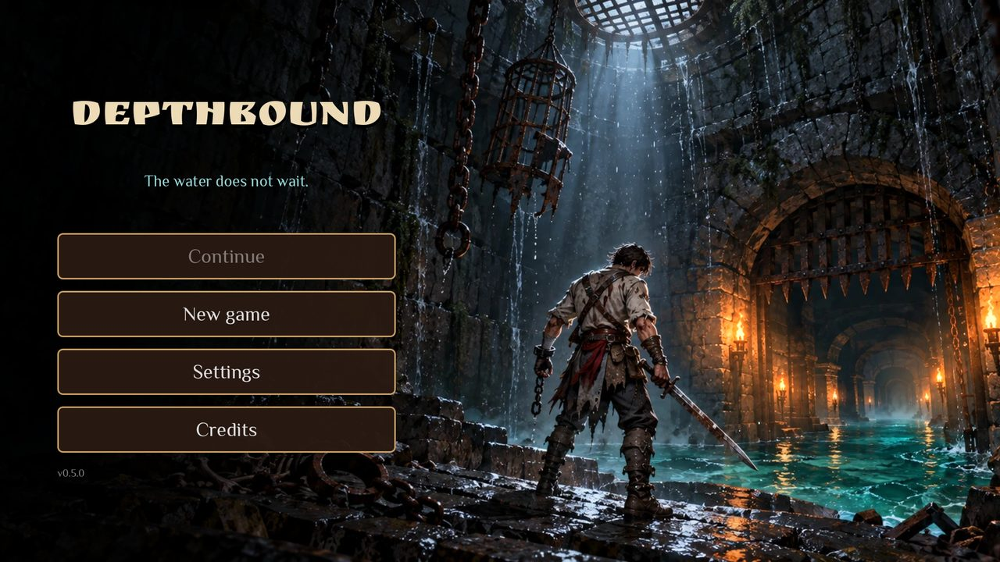

> **Status: finished experiment. Playable MVP, no further development planned.**
>
> I had $100 of Claude credits and a few minutes. The question was simple: how far can one AI agent take a real game from a single design document? The idea took me minutes. Claude Opus 5.5 (in Claude Code) spent about 1.5 hours of agent time writing it. This repository is the result, as it is, with all its rough edges.

## What's in the build

The full MVP loop works end to end:

**main menu → hero select (male / female) → intro → camp → floors 1–10 → two bosses → final chest → back to camp**

| | |
|---|---|
| 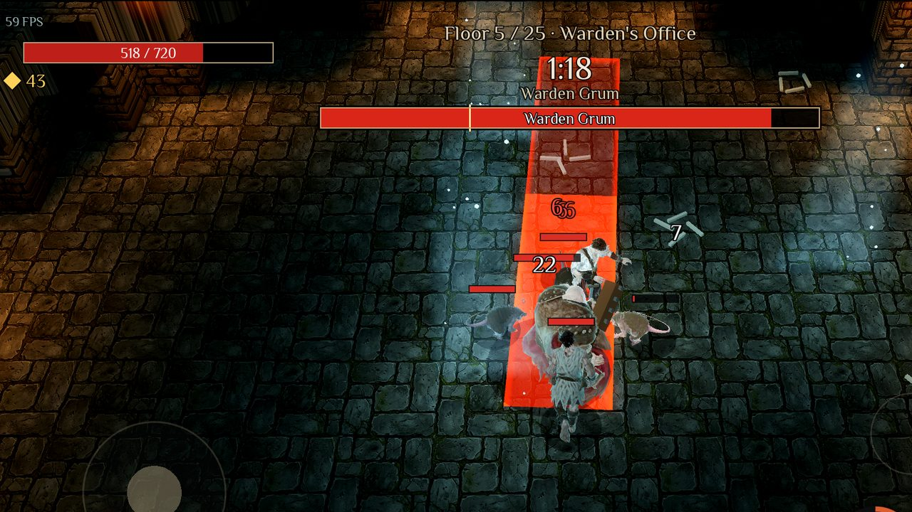 | 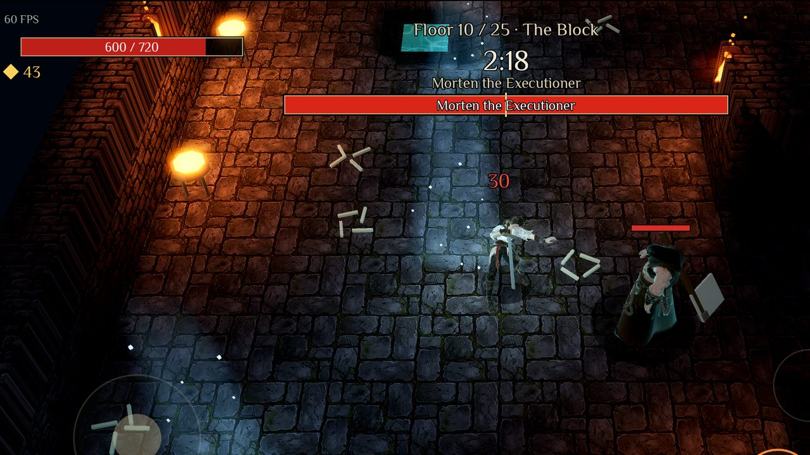 |
| **Warden Grum** (floor 5): telegraphed attacks, summons, enrage | **Morten the Executioner** (floor 10): two phases |
| 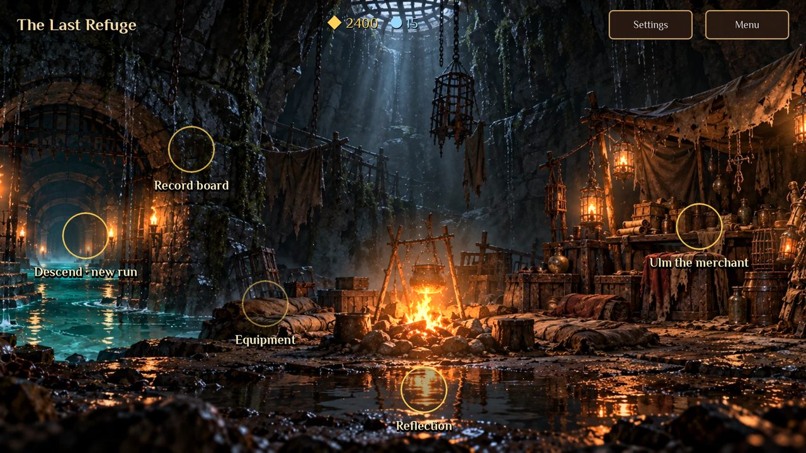 | 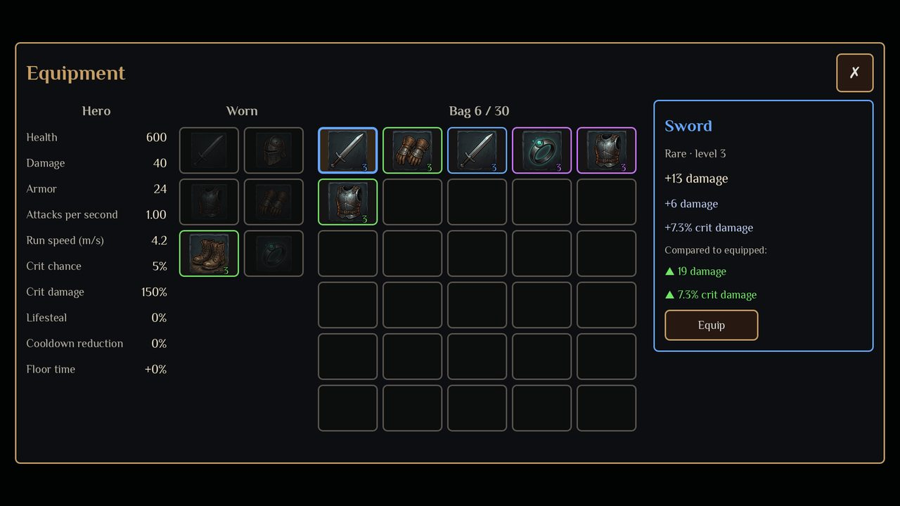 |
| **The Last Refuge**: merchant, gear, records, appearance | **Gear**: 6 slots, 5 rarities, item comparison |

- **Time is the main resource.** Every floor has a timer, and the water rises in 4 phases. You can't clear everything, so you choose what to fight, what to loot and when to run.
- **Combat:** floating joystick, auto-attack while standing still, tap to pick a target, dodge with i-frames, 12 skills with 5 levels each, AUTO mode.
- **Enemies:** rat, prisoner, jailer, crossbowman, drowned, plus the Chain Brute elite. Packs share aggro, and enemies have leashes, ranged kiting and telegraphed abilities.
- **Floors:** 10 hand-laid maps, each with its own layout and visual accent. Objectives are breakthrough, key carrier and seals. There are traps (spikes, bear traps, harpoon walls), levers, valves, flood sluices and a healing spring.
- **Meta:** upgrade cards after each floor (pick 1 of 3, reroll, reforge), loot, a merchant, records, autosave and continue.
- **Languages:** English, Russian and Spanish.

## Play it

Download a build from [**Releases**](../../releases/latest):

- **Windows**: unzip and run `Depthbound.exe`.
- **Android**: a debug APK (arm64 + x86_64) that works on a phone or in an emulator (BlueStacks, LDPlayer, Android Studio).
- **macOS**: unsigned. Unzip, then right-click → Open.

**PC controls:** WASD or mouse (acts as a finger) to move, Space to dodge, 1–3 for skills, E to interact, Esc to pause, F3 for the debug menu. Run `Depthbound.exe -- --floor=7` to start on any floor.

## How it was built

1. **Idea**, a few minutes from me.
2. **Design document**, Russian, about 1,100 lines. It covers mechanics, numbers, floors, bosses, art pipeline and MVP scope. The original v1.0 that served as the prompt is kept as-is: [`docs/GDD-v1.0-original.md`](docs/GDD-v1.0-original.md).
3. **Concept art** for the hero, bosses, enemies, camp, menu and map style. I generated these myself: [`references/`](references/).
4. **One agent run.** Claude planned the stages, wrote the code, generated 3D models and animations through the Meshy API, wired up CI and logged every decision it made on its own in [`DECISIONS.md`](DECISIONS.md).

Usually my line is *"AI does the typing — the architecture, the calls and the mistakes are mine."* This one was deliberately different: I gave a document and a few answers, and the agent made most of the calls itself. That was the experiment.

Concept art used as references

| | |
|---|---|
| 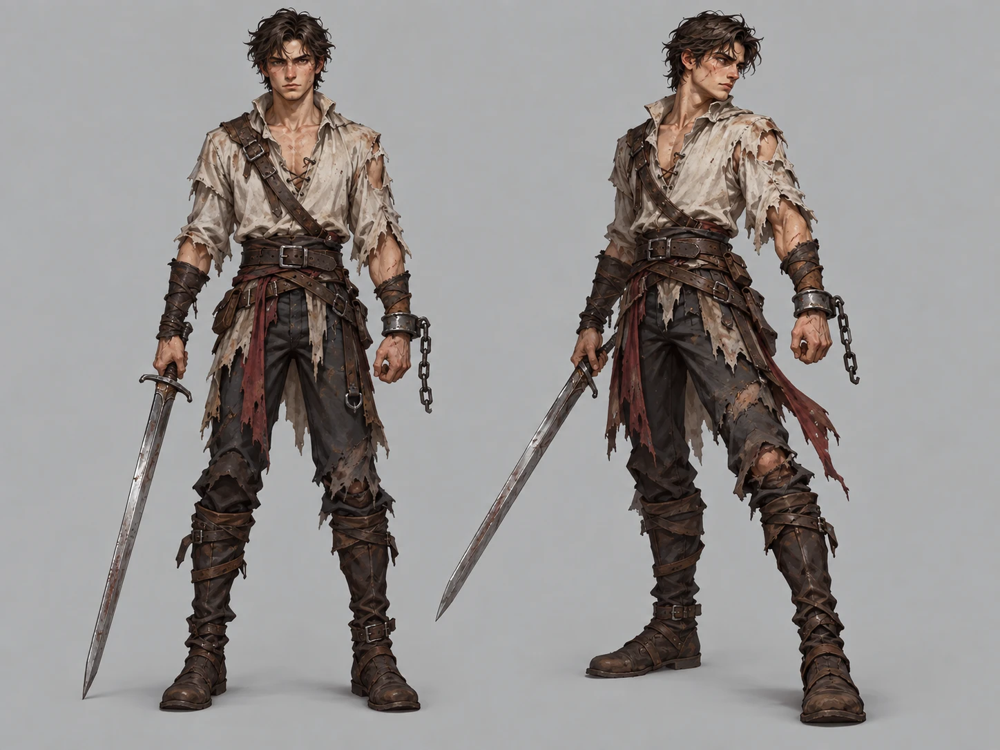 | 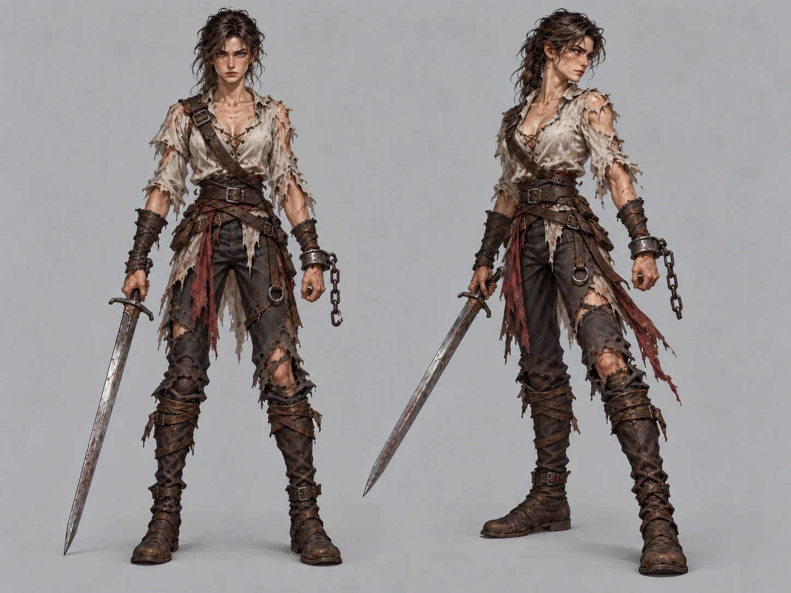 |
| 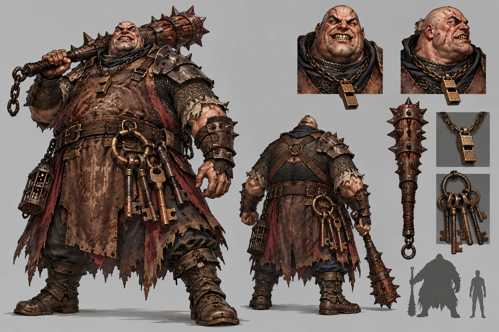 | 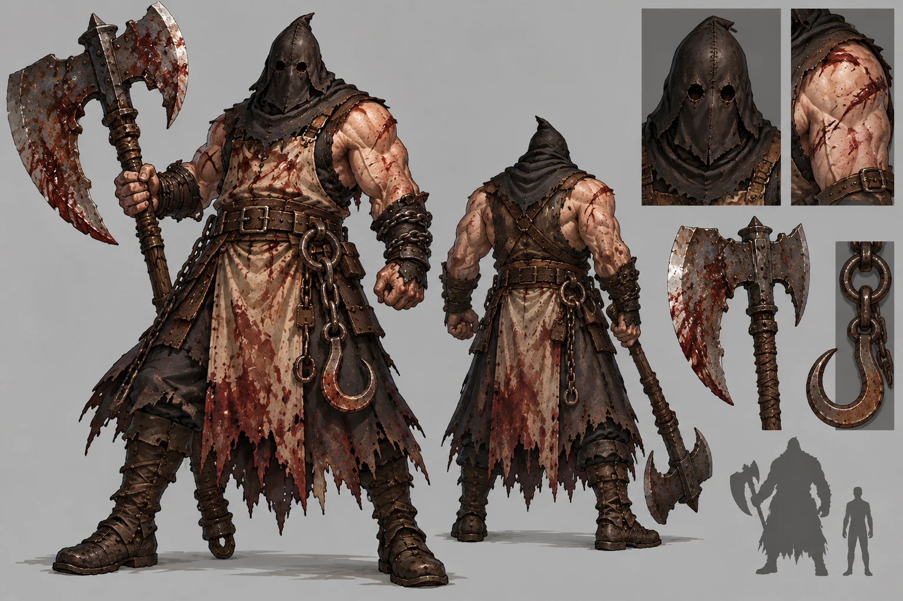 |
| 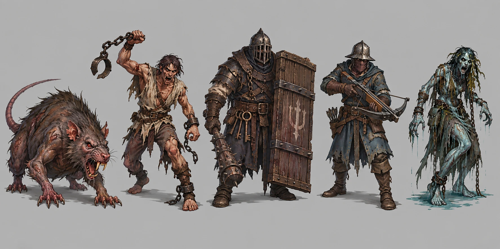 | 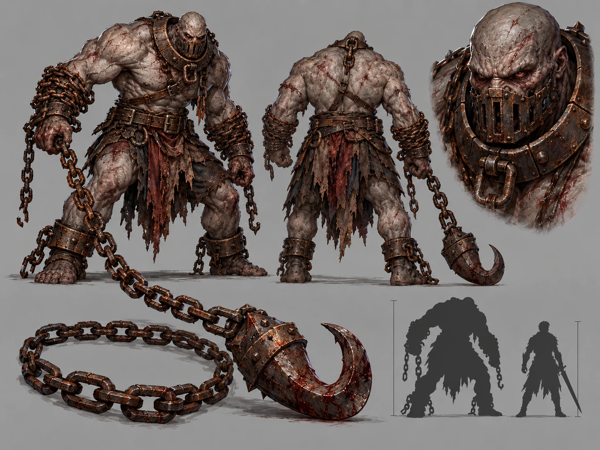 |
| 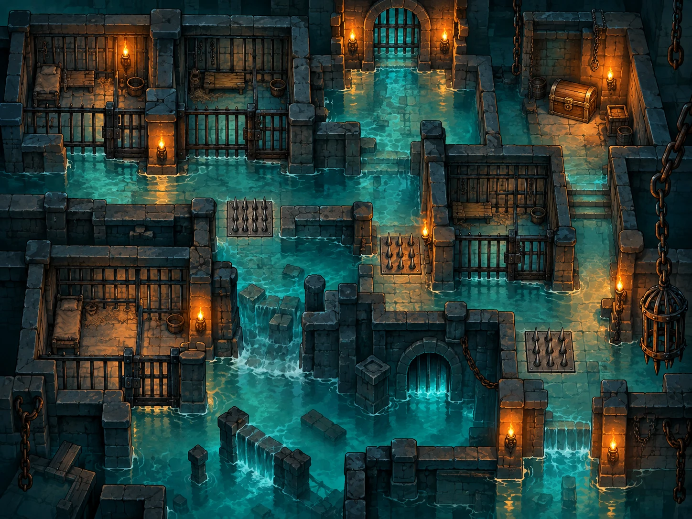 | 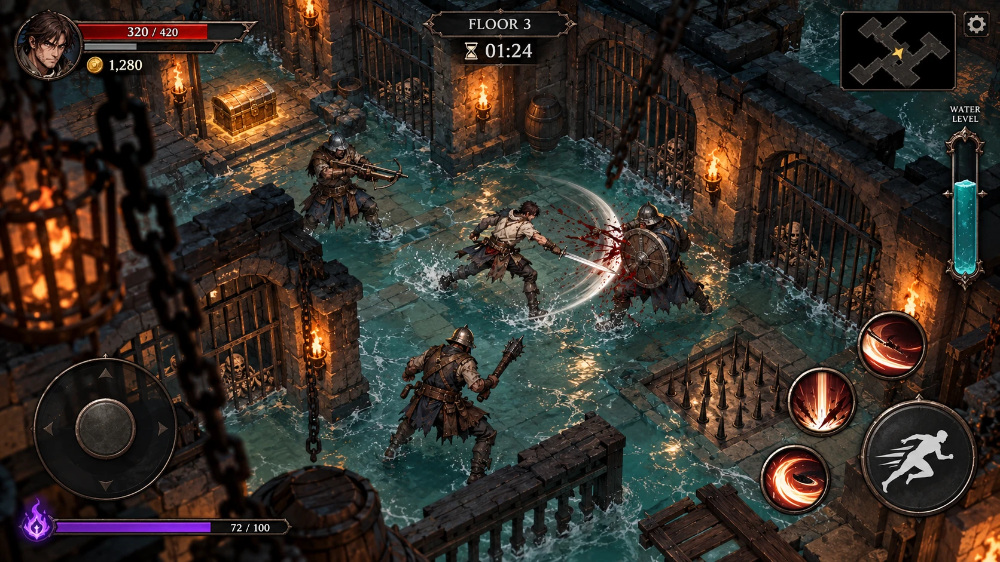 |

## Engineering notes

- **Godot 4.7.2, GDScript.** About 11,800 lines with static typing. Uses the Compatibility renderer for wide Android support.
- **Logic is separate from rendering.** The whole simulation runs in a 2D floor plane through `World.step(dt)` at a fixed 1/60 s. The 3D views only read state, so a bot can run floors faster than real time with no graphics.
- **No physics engine in gameplay.** Collisions are circles against the grid and against other circles. Hits are geometric queries (circle, cone, line, rectangle). The result is deterministic and easy to test.
- **Fair randomness.** Separate seeded RNG streams (`loot`, `cards`, `combat`, `ai`, …) derived from run seed, floor and stream name. Restarting a floor doesn't reroll its loot.
- **A bot tester.** It plays floors in breakthrough and full-clear modes and checks the timer rules. It also plays the whole dungeon from scratch like an average player: it dies, shops and equips. Boss numbers were rebalanced after the bot showed the design-doc values were unwinnable (see D24 in `DECISIONS.md`).
- **137 unit tests** with a small custom runner (`tools/run_tests.sh`, headless).
- **CI** runs the tests, renders screenshots with software OpenGL, exports Windows, Android, macOS and Linux builds, and smoke-tests the Linux export.
- **Data-driven.** All balance numbers live in `data/*.json` and all text in `localization/strings.csv`. Floor maps are ASCII grids generated by `tools/mapgen/floors.py`.
- **Mobile-friendly lighting.** Torch light is baked into a per-floor grid texture with wall occlusion, with no dynamic lights. The shaders are custom.

## Known gaps

This was a test, not a product, so these were never done:

- Never profiled on a real mid-range Android phone. The 60 FPS target is unverified.
- Balance was tuned by the bot, not by a full human playtest.
- The English and Spanish texts are agent drafts and haven't been proofread by native speakers.
- The internal docs (`docs/GDD.md`, `docs/PLAN.md`, `DECISIONS.md`) are in Russian.

## Repository map

| Path | What |
|---|---|
| `scripts/core/`, `scripts/combat/` | simulation: world, hero, mobs, bosses, damage, statuses, telegraphs |
| `scripts/skills/` | one script per skill |
| `scripts/level/`, `levels/d01/` | floor loading, objects, traps; ASCII maps and their parameters |
| `scripts/view/`, `shaders/` | 3D views, water, light grid, telegraphs |
| `scripts/ui/`, `scripts/screens/` | HUD, windows, menus, camp |
| `scripts/dev/`, `tests/` | bot tester and unit tests |
| `art/` | asset registry with licenses, prompts, Meshy job sources |
| `docs/` | design doc, plan, original prompt |

**Build from source:** open the project in Godot 4.7.2. Run the tests with `tools/run_tests.sh`.

## Credits and license

- Code and original assets: [MIT](LICENSE).
- 3D models, animations, icons and intro frames were generated with [Meshy](https://www.meshy.ai). The concept art is mine.
- Sounds and music are CC0 from [Kenney](https://kenney.nl) and [OpenGameArt](https://opengameart.org). Fonts are Philosopher, Ruslan Display and Noto Sans Symbols 2 (SIL OFL 1.1). Every asset and its source is listed in [`art/ASSETS.md`](art/ASSETS.md).

---

Part of **[Augustus Forge](https://x.com/augustus_forge)**: autonomous systems, built in public. Failures included. Wins earned.
